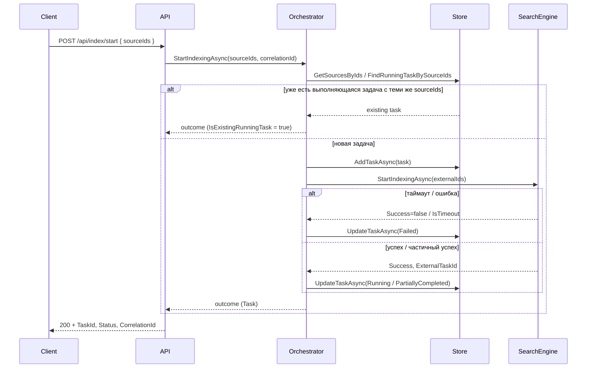

# Search Orchestrator — сервис-оркестратор поиска

Упрощённый каркас сервиса-оркестратора, который управляет процессом индексации файлов во **внешнем сервисе поиска** (Search Engine) и предоставляет API для поиска по строке. Чтение файлов и индексация не реализованы — это зона ответственности внешнего сервиса; оркестратор только ставит задачи и хранит мета-информацию.

## Архитектура

### Слои и границы ответственности

```
┌─────────────────────────────────────────────────────────────────┐
│  API (SearchOrchestrator.Api)                                    │
│  HTTP-контракты, корреляция запросов, Swagger                     │
└───────────────────────────────┬─────────────────────────────────┘
                                │
┌───────────────────────────────▼─────────────────────────────────┐
│  Core (SearchOrchestrator.Core)                                  │
│  Оркестрационная логика: постановка задач, идемпотентность,      │
│  обработка ошибок/таймаутов/частичного успеха, мета-данные        │
│  Интерфейсы: ISearchEngineClient, IIndexingTaskStore              │
└───────────────────────────────┬─────────────────────────────────┘
                                │
┌───────────────────────────────▼─────────────────────────────────┐
│  Infrastructure (SearchOrchestrator.Infrastructure)              │
│  MockSearchEngineClient (заглушка внешнего сервиса),             │
│  InMemoryIndexingTaskStore (хранилище задач/источников)           │
└─────────────────────────────────────────────────────────────────┘
```

- **API**: приём запросов, передача в Core, возврат ответов, заголовок `X-Correlation-ID`, логирование запросов.
- **Core**: бизнес-логика оркестрации — без привязки к HTTP и к конкретной реализации хранилища/клиента поиска.
- **Infrastructure**: реализация контрактов Core (mock поиска, in-memory store); в проде — реальный клиент и БД/очереди.

### Модели данных (минимальные)

| Модель | Назначение |
|--------|------------|
| **IndexingTask** | Задача индексации: Id, CorrelationId, SourceIds, Status (Pending/Running/Completed/Failed/Cancelled/PartiallyCompleted), время создания/старта/завершения, ErrorMessage, Details, ExternalTaskId. |
| **IndexingSource** | Источник: Id, ExternalId (для внешнего сервиса), DisplayName, LastIndexedAtUtc, LastTaskId. |
| **SearchResult** | Результат поиска: Query, Items (Id, Title, Snippet, SourceId), TotalCount, CorrelationId. |

Результаты вызовов внешнего сервиса: `IndexingSubmissionResult`, `ExternalTaskStatusResult`, `CancelTaskResult` — для единообразной обработки успеха, ошибки, таймаута и частичного успеха.

### Основные потоки (sequence)

Запуск индексации (упрощённо):



1. **Запуск индексации**  
   `POST /api/index/start` → проверка sourceIds → проверка идемпотентности (уже есть выполняющаяся задача с тем же набором источников?) → создание задачи → вызов внешнего сервиса → обновление статуса (успех/ошибка/таймаут/частичный успех) → ответ с TaskId и статусом.

2. **Статус задачи**  
   `GET /api/index/status/{id}` → поиск по TaskId или CorrelationId → возврат мета-информации задачи.

3. **Поиск**  
   `GET /api/search?q=...` → вызов внешнего сервиса → возврат результатов с CorrelationId.

4. **Отмена задачи**  
   `POST /api/index/tasks/{id}/cancel` → отмена во внешнем сервисе (если есть ExternalTaskId) → переход задачи в Cancelled.

5. **Регистрация источника**  
   `POST /api/sources` → создание записи источника (ExternalId, DisplayName) → возврат SourceId (нужен для запуска индексации).

### Контракты API

| Метод | Путь | Описание |
|-------|------|----------|
| POST | `/api/sources` | Регистрация источника. Body: `{ "externalId": "...", "displayName": "..." }`. |
| POST | `/api/index/start` | Запуск индексации. Body: `{ "sourceIds": ["id1", "id2"], "correlationId": "..." }`. Идемпотентность: при повторном запросе с тем же набором sourceIds и уже выполняющейся задачей возвращается существующая задача. |
| GET | `/api/index/status/{id}` | Статус задачи (id — TaskId или CorrelationId). |
| POST | `/api/index/tasks/{id}/cancel` | Отмена задачи. |
| GET | `/api/search?q=...&max=100` | Поиск по строке. |

Во всех ответах при необходимости возвращается/пробрасывается заголовок `X-Correlation-ID` для корреляции запросов в логах.

### Обработка ошибок внешнего сервиса

- **Ошибка**: внешний сервис вернул отказ → задача переводится в Failed, ErrorMessage сохраняется, ответ 200 с полем `accepted: true`, в теле — статус задачи с ошибкой.
- **Таймаут**: клиент ждёт дольше заданного времени → задача в Failed, в логах — предупреждение.
- **Частичный успех**: внешний сервис принял задачу, но часть источников не проиндексирована → статус PartiallyCompleted, детали в Details.

Ретраи на уровне дизайна: повторный вызов `StartIndexing` с теми же sourceIds считается идемпотентным и возвращает уже созданную выполняющуюся задачу; при необходимости повторной постановки после сбоя можно ввести отдельный сценарий «переиндексация» (повторный старт после завершения предыдущей задачи).

### Наблюдаемость

- **Корреляция**: middleware задаёт/пробрасывает `X-Correlation-ID`, пишет его в `HttpContext.Items` и в ответ; логи обогащаются корреляционным идентификатором (Serilog FromLogContext / Enrich).
- **Логирование**: ключевые события в Core и Infrastructure (создание задачи, идемпотентный возврат, таймаут/ошибка внешнего сервиса, поиск).

## Сборка и запуск

Требуется .NET 8 SDK.

```bash
dotnet restore
dotnet build
dotnet run --project src/SearchOrchestrator.Api
```

API будет доступен по адресу из launchSettings (например, `http://localhost:5000`). Swagger UI: `http://localhost:5000/swagger`.

### Конфигурация mock-сервиса (appsettings.json)

Секция `MockSearchEngine`:

- `SimulateTimeout` — имитация таймаута при постановке задачи.
- `SimulateFailure` — имитация отказа при постановке.
- `SimulatePartialSuccess` — имитация частичного успеха.
- `SimulateSearchTimeout` / `SimulateSearchFailure` — то же для поиска.
- `IndexingDelayMs`, `TimeoutDelayMs`, `FailureMessage` — задержки и текст ошибки.

## Тесты

В проекте `SearchOrchestrator.Tests` — тесты оркестрационной логики с mock внешнего сервиса и in-memory store:

- идемпотентность при повторном запуске индексации с теми же sourceIds;
- отклонение при пустом/неизвестном sourceIds;
- обработка ошибки и таймаута внешнего сервиса;
- успешный поиск и возврат результата с CorrelationId.

Запуск:

```bash
dotnet test tests/SearchOrchestrator.Tests
```

## Структура репозитория

```
├── src/
│   ├── SearchOrchestrator.Api/          # HTTP API, middleware, маршруты
│   ├── SearchOrchestrator.Core/        # Модели, контракты, оркестратор
│   └── SearchOrchestrator.Infrastructure/  # Mock-клиент, in-memory store
├── tests/
│   └── SearchOrchestrator.Tests/       # Тесты оркестрации с mock
├── SearchOrchestrator.sln
└── README.md
```

Каркас готов к расширению: замена Mock на реальный клиент Search Engine, персистентное хранилище задач, фоновое обновление статусов (Hosted Service), ретраи и политики устойчивости (Polly).
